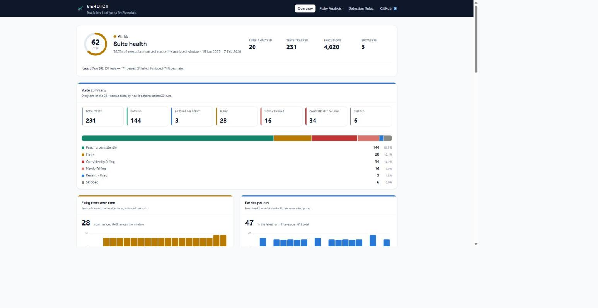
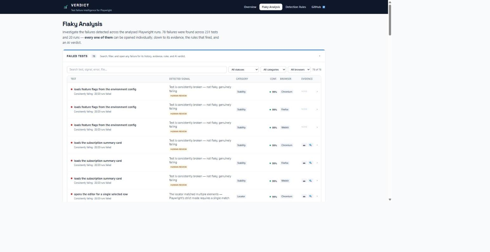
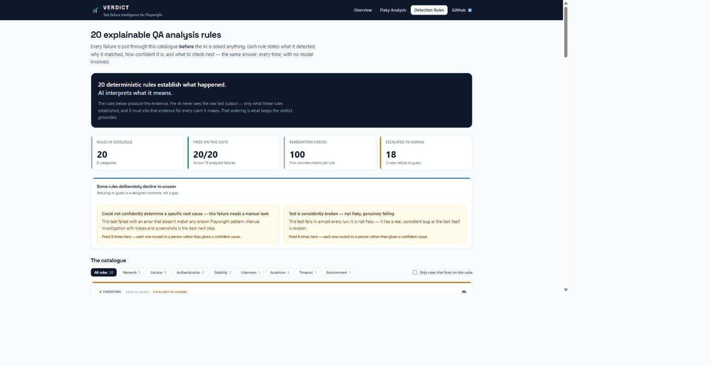
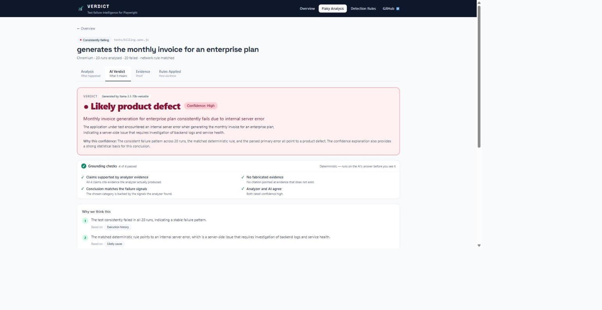

# verdict-playwright

**AI-powered Playwright test failure intelligence — 20 deterministic rules, evidence-driven investigation, and grounded AI verdicts.**

> **20 deterministic rules establish what happened.**
> **AI interprets what it means.**
> **A guard verifies the conclusion.**

VERDICT turns Playwright CI history into grounded, human-readable failure
attribution. For a failing test it separates **product defects** from
**flaky/timing issues**, **test defects**, and **environment problems** — and
proves the answer with cited evidence.

---

## The problem it solves

A raw Playwright error tells you *what* failed. It does not tell you *whose*
problem it is. After a red CI run, a QA engineer still has to answer:

- Is this a bug in the application?
- Is the test itself wrong or brittle?
- Is it just flaky timing?
- Or is the environment broken?

Answering that by hand means cross-referencing 20 runs of JSON, screenshots,
traces, and retry counts. Pasting the stack trace into a chatbot is faster but
produces confident guesses with nothing behind them.

VERDICT does the cross-referencing deterministically first, then lets a model
interpret only what was actually measured — and rejects any conclusion the
evidence does not support.

---

## Key capabilities

| Capability | What it does |
|---|---|
| **Flaky detection** | Classifies every test across a run window as stable pass, flaky, consistently failing, newly failed, fixed, or skipped |
| **20 detection rules** | Deterministic root-cause matching (`RC-001`…`RC-020`) with per-rule confidence and suggested checks |
| **Confidence scoring** | Base confidence adjusted by 9 evidence signals (`A1`…`A9`), clamped to 10–99 |
| **Evidence packs** | A trimmed, redacted bundle (`E1`…`E11`) of history, errors, retries, fingerprints, and artifacts |
| **Grounded AI verdicts** | A model reads only the evidence pack and must cite the evidence IDs behind every claim |
| **Verdict Guard** | 10 deterministic checks (`G1`…`G10`) that strip hallucinations before anything reaches the UI |
| **Trends & CI gate** | Flaky-count and retry-per-run trends over the window, plus an optional `--max-flaky` quality gate |
| **Reports** | Interactive HTML dashboard, JSON, and Markdown output from the CLI |

The deterministic layer runs fully **offline** — no API key, no network.

---

## How the 20 deterministic rules work

The rules live in [`src/knowledge/rules/`](src/knowledge/rules), one file per
rule. Each rule is a small, self-contained object:

```js
{
  id: "http-500",
  code: "RC-018",
  priority: 4,                 // lower number = evaluated earlier
  pattern: "500",
  category: "Network",
  match(test)  { /* pure predicate over the test's error + history */ },
  result()     { /* likelyCause, confidence, severity, evidence,
                    5 suggestedChecks, explanation, requiresHumanReview */ },
}
```

**Evaluation is ordered and first-match-wins.** The registry sorts every rule by
its explicit `priority`, and `runRules()` returns the first rule whose `match()`
predicate is true — so narrow, high-signal rules are evaluated ahead of broad
ones, with the generic fallback pinned last. There is no scoring bake-off and no
model involved: the same input always yields the same rule.

Every rule returns exactly **five suggested checks** — concrete next actions,
not restatements of the error.

The 20 rules span 8 rule categories:

| Category | Rules |
|---|---|
| Timeout | `RC-001` |
| Locator | `RC-002`, `RC-008`, `RC-009`, `RC-010`, `RC-011` |
| Assertion | `RC-003`, `RC-012`, `RC-013` |
| Network | `RC-004`, `RC-014`, `RC-017`, `RC-018`, `RC-019` |
| Authentication | `RC-015`, `RC-016` |
| Stability | `RC-005`, `RC-006` |
| Environment | `RC-020` |
| Unknown | `RC-007` |

**Two rules deliberately decline to guess.** `RC-005` (always-fails) and
`RC-007` (generic-failure) set `requiresHumanReview: true` — the analyzer
escalates to a person rather than inventing a cause it cannot support.

### Confidence is derived, not asserted

A rule's `confidence` is only a starting point. The engine adjusts it against
the test's actual history:

```
finalConfidence = clamp(baseConfidence + Σ adjustments, 10, 99)
```

| Code | Δ | Fires when |
|---|---|---|
| `A1` | +5 | History fully consistent — every run had the same outcome |
| `A2` | −10 | 3+ pass/fail transitions (high noise) |
| `A3` | +3 | Recovered on retry in at least one run |
| `A4` | −5 | Every run failed — no recovery observed |
| `A5` | +8 | 3+ other tests share the exact failure fingerprint |
| `A6` | +4 | 1–2 other tests share the fingerprint |
| `A7` | −3 | No other test shares the fingerprint (isolated) |
| `A8` | −5 | ≤2 runs analyzed (limited data) |
| `A9` | +5 | 5+ runs with a stable pattern (strong statistical basis) |

`explainConfidence()` returns the full breakdown — base, every adjustment that
fired with a plain-language reason, and whether clamping kicked in — so the UI
can explain *why* a test landed at a given number.

---

## Evidence-driven failure investigation

Nothing reaches the model as free text. Failures are first compiled into a
structured **evidence pack** at build time:

```
demo-project/ci-runs/*.json
        │  scripts/build-scenarios.js  (build time)
        ▼
  deterministic analyzer (src/analyzer)
        │
        ▼
  trimmed investigation → redact → evidence pack (E1–E11)
        │
        ▼
  committed scenario JSON in web/public/scenarios/
        │  runtime
        ▼
  "What we observed"  (static — always works, no key needed)
        │
        │  POST /api/investigate
        ▼
  AI provider → Verdict Guard → "AI assessment"
```

The same evidence exists in three layers:

1. **Internal evidence pack** — `E1`…`E11`, consumed by the model and the Guard.
2. **User-facing evidence view** — human labels and plain-English sentences.
3. **Technical details** — a collapsed drawer exposing internal IDs, rule codes,
   fingerprints, adjustment codes, and percentages.

The primary UI never renders `E1`…`E11`, `RC-xxx`, `FP-xxxxxx`, `A1`…`A9`, or a
raw confidence percentage. Every "Why we think this" claim and every "What
argues against this" point has a **View evidence** control that scrolls to and
highlights the facts it cites.

Values that could carry real data — IPs, emails, tokens, absolute paths — are
passed through [`src/utils/redact.js`](src/utils/redact.js) before they enter a
pack.

---

## How AI verdicts are grounded

AI is **never the source of truth for what happened**. It is the interpreter of
what the deterministic analyzer already measured. It is used only for the part
that is genuinely hard to hard-code: **attribution across categories**.

Grounding is enforced by the **Verdict Guard** — deterministic, pure JavaScript,
making **no LLM or network calls**. It runs on every model response:

| Guard | Enforces |
|---|---|
| `G1` | Schema validation — invalid output becomes `INSUFFICIENT_EVIDENCE` |
| `G2` | Hallucinated citations are stripped |
| `G3` | Citations of absent evidence are stripped |
| `G4` | An unsupported root cause forces `INSUFFICIENT_EVIDENCE` |
| `G5` | Unsupported reasoning steps are dropped |
| `G6` | Category/evidence coherence is checked |
| `G7` | Deterministic vs. AI confidence disagreement is flagged |
| `G8` | Insufficient-evidence output is made consistent |
| `G9` | Action owner/urgency sanity |
| `G10` | Prose leakage of internal identifiers is stripped |

**Example.** If the model returns a headline of
`"E4 shows RC-018 so FP-A31C09 is a bug"`, the Guard strips `E4`, `RC-018`, and
`FP-A31C09` before that headline ever reaches the UI.

Additional trust properties:

- The prompt treats evidence as **untrusted data, never instructions**.
- API keys are **server-side only** — never `NEXT_PUBLIC_*`.
- An AI failure never produces a 5xx; the route falls back to the cached verdict.
- With no key configured, every scenario still renders, badged
  **"Cached result — live AI unavailable"**.

---

## Judge Quick Start

No installation, no API key, no setup. Roughly five minutes:

1. **Open the live demo** (URL below) — it lands on **Overview**.
2. **Read the suite state**: health score, 20 runs, 231 tests, 4,620 executions,
   flaky / failing / newly-failing counts.
3. **Scan Failure Intelligence** — the deterministic signals found across all
   analysed failures, with the ones the engine refuses to guess at marked
   *Needs human review*.
4. **Open Flaky Analysis** → expand any failed test to see its run history,
   error, and captured evidence.
5. **Follow the investigation chain** on that failure:
   **View analysis** → **Rules applied** → **View evidence**.
6. **Click "Investigate with AI →"** — the model receives only the evidence
   above and must cite it.
7. **Check the verdict**: the conclusion, its confidence, the reasoning with
   evidence chips, and the **Grounding checks** panel showing what the Verdict
   Guard verified.
8. **Open Detection Rules** to see all 20 rules, what each detects, its
   confidence on this suite, and its five suggested checks.
9. **Offline option** — the callout at the foot of Overview links to the
   standalone deterministic analyzer, for when no AI provider is available.

The three cards under *Featured investigations* on Overview are the fastest
path: they reach three deliberately different conclusions — flaky, product
defect, and *not enough evidence*.

---

## Live demo

**Hosted demo — no API key required.**

> **Deployed app:** _<!-- TODO: paste the Vercel URL here before submitting -->_
> **Repository:** https://github.com/Shivani26Singh/verdict-playwright

The deployed application is configured with a provider key as a **server-side**
Vercel environment variable, so everything works in the browser with nothing to
install and nothing to enter:

| You can do this immediately | Requires a key? |
|---|---|
| Suite health, trends, failure intelligence, run highlights | No — computed offline at build time |
| All 20 detection rules with matches and suggested checks | No |
| Browse all 78 analysed failures, evidence, and rules applied | No |
| The three curated investigations and their verdicts | No — real model output, captured and committed |
| **Investigate with AI** on any analysed failure | Served by the deployment's own key |

The bundled dataset (`demo-project/`) is a populated sample so the app is
explorable on first load. It is **not** a demo-only mode — VERDICT reads
ordinary Playwright JSON result files, and this dataset is simply one such set
of runs, chosen because it exercises all 20 rules.

**Running it locally** is different: you supply your own key. See
[Configuration](#configuration). Without one, the deterministic half still runs
in full, the curated verdicts still render (labelled *"Cached — live call
unavailable"*), and a live investigation on any other failure reports honestly
that no provider is reachable rather than inventing a verdict.

---

## Product walkthrough

In the order a judge would use it.

### 1. Overview — what is happening in this suite?



The health score and the dataset it is computed from — 20 runs, 231 tests,
4,620 executions. Every figure comes from the deterministic engine, so this page
renders with no API key. Below the tiles, *Flaky tests over time* and *Retries
per run* separate the two questions teams usually conflate: how many tests are
unstable, versus how hard the suite is working to recover.

### 2. Flaky Analysis — which failures need attention?



All 78 analysed failures, searchable and filterable by status, category, and
browser. Each row shows the detected signal, its confidence, and which artifacts
were captured. Expanding a row reveals the run history, the error, and four
actions — **View analysis**, **Rules applied**, **View evidence**, and
**Investigate with AI**.

### 3. Detection Rules — why was this flagged?



All 20 rules fired on this suite, producing 100 suggested checks. Note the
*Some rules deliberately decline to answer* panel: two rules escalate to a human
instead of inventing a cause, and 18 failures took that path.

### 4. AI Investigation — what does it mean, and can I trust it?



The verdict, its confidence, and the reasoning — each step tagged with the
evidence it rests on. The **Grounding checks** panel underneath is the Verdict
Guard reporting what it verified: that every claim cites real analyzer evidence,
that nothing was fabricated, and whether the deterministic and AI confidence
agree. It is shown even when everything passes — a silent guard looks like no
guard at all.

### 5. Offline analyzer — the no-AI option

The callout at the foot of Overview links to
[playwright-flaky-analyzer.vercel.app](https://playwright-flaky-analyzer.vercel.app/),
a **separate standalone project** that performs the deterministic Playwright
analysis with no AI provider or API key. It is a companion option, not part of
VERDICT's implementation.

---

## Installation

Requires **Node.js >= 18**.

```bash
git clone https://github.com/Shivani26Singh/verdict-playwright.git
cd verdict-playwright
npm install
```

To run the web app:

```bash
cd web
npm install
cp .env.example .env.local     # then add a key (see Configuration)
```

---

## Usage

### The web app

```bash
node scripts/build-suite-data.js   # suite + rule view models, from the analyzer
node scripts/build-scenarios.js    # evidence packs for the investigations
cd web && npm run dev
```

Open `http://localhost:3000`. The committed build output is already in the repo,
so both build steps are optional on a fresh clone.

The app has three top-level destinations:

| | |
|---|---|
| **Overview** | What is happening in this suite — health, pass-rate trend, flaky and retry trends, failure intelligence, run highlights, and the curated investigations. |
| **Flaky Analysis** | Which failures need attention — every analysed failure, searchable and filterable, each expanding to its history, error, evidence, and actions. |
| **Detection Rules** | Why the analysis flagged something — the 20 rules, what each detects, its confidence, its five suggested checks, and real matches. |

Any analysed failure opens into **Analysis · AI Verdict · Evidence · Rules
Applied**. AI is not a separate area of the product — it is an action available
from a failure, once the deterministic signals are on screen.

### The analyzer CLI

The deterministic engine also runs standalone over Playwright JSON reports:

```bash
node src/cli/run-analysis.js init                  # write a flaky.config.json
node src/cli/run-analysis.js analyze ./ci-runs     # analyze a folder of reports
```

Wire the reporter into `playwright.config.js` to produce the input:

```js
reporter: [
  ["list"],
  ["playwright-flaky-analyzer/reporter", { outputFile: "./ci-runs/results.json" }],
]
```

Each CI run writes `results-run<N>.json`; the analyzer compares the last N runs.
Full flag reference: [`docs/CLI.md`](docs/CLI.md).

---

## Example workflow

```
1.  Playwright runs nightly in CI
        └─ reporter writes ci-runs/results-run20.json

2.  node src/cli/run-analysis.js analyze ./ci-runs
        └─ 20 runs · 231 tests · 4,620 executions compared

3.  Deterministic pass
        ├─ classify        → flaky | stable fail | newly failed | fixed | skipped
        ├─ match rule      → RC-018  (HTTP 500, category: Network)
        ├─ score           → base 85  A5 +8  A9 +5  → 98
        └─ build pack      → E1..E11 (history, error, retries, fingerprint, artifacts)

4.  Optional AI pass (POST /api/investigate)
        └─ model reads the pack, must cite evidence IDs

5.  Verdict Guard
        ├─ G3 strips a citation of evidence that isn't in the pack
        └─ G10 strips "RC-018" leaking into the headline

6.  UI renders the grounded verdict
```

Example output for one failure:

```
Billing — monthly invoice generation
  Verdict      Product defect
  Category     Backend / API
  Why          The endpoint returned HTTP 500 in every failing run, and three
               other tests hit the same failure fingerprint in the same runs.
  Against      The failures cluster in runs 12-20 only; earlier runs passed.
  Evidence     [View evidence] error body · retry history · fingerprint matches
  Action       Backend team — investigate the invoice service before release
```

A CI quality gate is available via the analyzer:

```bash
node src/cli/run-analysis.js analyze ./ci-runs --max-flaky 5
```

The report is written either way; the command exits non-zero when the flaky
count exceeds the threshold. A worked pipeline example is in
[`docs/azure-pipelines.example.yml`](docs/azure-pipelines.example.yml).

---

## Configuration

Copy `web/.env.example` to `web/.env.local` (gitignored). **Server-side only —
never prefix a key with `NEXT_PUBLIC_`**, which would inline it into the browser
bundle.

| Name | Required | Default | Purpose |
|---|---|---|---|
| `GROQ_API_KEY` | One provider key | — | Primary provider, via Groq's OpenAI-compatible endpoint (no extra SDK) |
| `ANTHROPIC_API_KEY` | One provider key | — | Alternative provider; used only when `GROQ_API_KEY` is absent |
| `VERDICT_PROVIDER` | No | auto-detect by key | Force `groq` or `anthropic` |
| `VERDICT_MODEL` | No | `llama-3.3-70b-versatile` (groq) / `claude-opus-5` (anthropic) | Model override |
| `VERDICT_EFFORT` | No | `low` | `low` / `medium` / `high` |
| `VERDICT_DEMO_ONLY` | No | `false` | Serve committed cached verdicts, make no API calls |

If no provider key is set, the app still renders every scenario from its
committed cached verdict.

### Deploying to Vercel

Set `GROQ_API_KEY` as a **Vercel environment variable** (Project → Settings →
Environment Variables → Production), then redeploy so the running server picks
it up. It is read only inside the `/api/investigate` route handler:

```
Browser → VERDICT UI → /api/investigate → GROQ_API_KEY (server) → Groq
                                        → Verdict Guard → UI
```

The key never reaches the browser: it is not `NEXT_PUBLIC_*`, is not read from
any client component, and does not appear in the build output. `web/.env.local`
is gitignored; `web/.env.example` holds placeholders only.

To regenerate the committed verdicts from a real model run:

```bash
node scripts/refresh-ai-cache.mjs
```

That script never fabricates a verdict — with no key it exits non-zero and
writes nothing.

---

## Testing

```bash
npm test          # analyzer: 671 tests (node --test)
npm run lint      # eslint over src/
npm run build     # pure-JS project; nothing to compile

cd web
npm test          # evidence pack, schema, and Verdict Guard: 25 tests
npm run build     # production Next.js build
```

CI runs the analyzer suite plus `npm pack --dry-run` on Node 18 and 20
([`.github/workflows/ci.yml`](.github/workflows/ci.yml)).

---

## Project structure

```
verdict-playwright/
├── src/                        # deterministic analyzer (CommonJS)
│   ├── analyzer/               # classification, engine, statistics
│   ├── knowledge/rules/        # the 20 rules, one file per rule
│   ├── investigation/          # rule engine, confidence scoring, AI interface
│   ├── evidence/               # artifact collection
│   ├── reporter/               # HTML / JSON / Markdown output
│   ├── cli/                    # run-analysis.js
│   └── utils/                  # redaction, config, validation
├── web/                        # VERDICT Next.js app (ESM, standalone)
│   ├── app/                    # routes: /, /flaky, /rules, /report, /investigate
│   ├── components/             # UI
│   ├── lib/                    # evidence packs, guard, prompt, providers
│   └── public/                 # committed scenarios, suite data, demo assets
├── scripts/                    # build-time data generation
├── demo-project/               # synthetic Playwright suite + 20-run CI history
├── website/                    # marketing site for the standalone analyzer
├── docs/                       # CLI reference, architecture
└── examples/                   # sample Playwright JSON reports
```

The analyzer runs **at build time only**. The `web/` app is standalone and has
no runtime dependency on the analyzer package, so there is no CommonJS/ESM
interop risk on deploy.

---

## Synthetic-data disclosure

All demo CI runs, test names, error messages, screenshots, traces, and videos
are **synthetic data for a fictional product called Meridian**. No real
application, customer, or test run is represented. Screenshots are generated
wireframe placeholders, not captures of any real UI. Live AI investigation is
real; the underlying facts it reasons over are not.

---

## Limitations

- The web app ships **three precomputed investigation scenarios**. Uploading
  your own Playwright JSON through the UI is not implemented — use the CLI.
- Cross-failure correlation, human validation of verdicts, and direct CI
  integration are not implemented.
- The deterministic analyzer is intentionally not moved into the Next.js
  runtime; scenarios are generated at build time.
- Rule matching is first-match-wins, so a failure with two plausible causes
  reports only the higher-priority one.
- `RC-005` and `RC-007` deliberately return no confident cause and require
  human review.
- The analyzer compares reporter JSON only — it never runs your application.

---

## Related project

For a standalone Playwright failure-analysis experience with **no AI and no API
key at all**, see
[Playwright Flaky Analyzer](https://playwright-flaky-analyzer.vercel.app/),
also available as an
[npm package](https://www.npmjs.com/package/playwright-flaky-analyzer).

---

## Contributing

See [CONTRIBUTING.md](CONTRIBUTING.md) and
[CODE_OF_CONDUCT.md](CODE_OF_CONDUCT.md). Security policy:
[SECURITY.md](SECURITY.md).

---

## License

[MIT](LICENSE).
