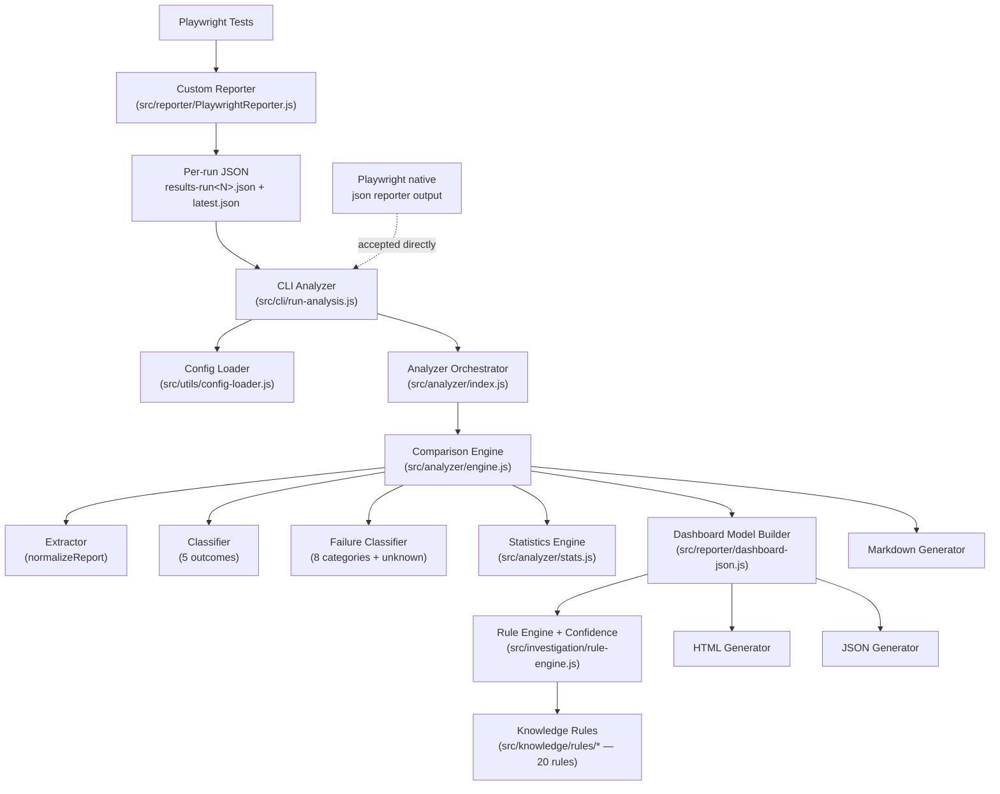
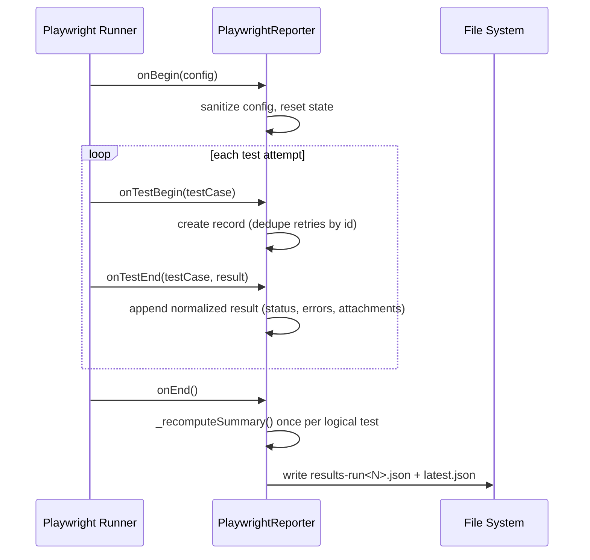
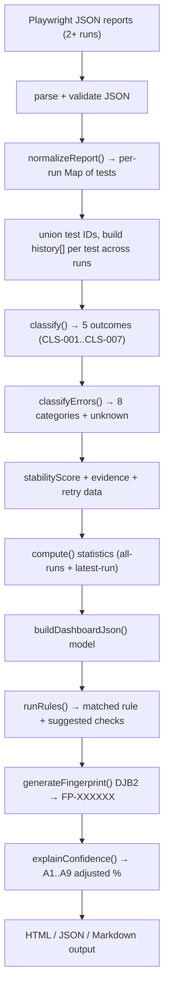

# ARCHITECTURE.md — Technical Architecture

> The internal architecture of **playwright-flaky-analyzer**, verified against the current source in `src/`. This document explains how the system works end to end so contributors, QA/automation engineers, developers, and reviewers can understand it without reading the code first.
>
> Cross-references: [README](../../README.md) · [STEPS](../../STEPS.md) · [API](../../API.md) · [REPORTER](./REPORTER.md) · [DESIGN_DECISIONS](../../DESIGN_DECISIONS.md) · [CONTRIBUTING](../../CONTRIBUTING.md) · [KNOWN_LIMITATIONS](../../KNOWN_LIMITATIONS.md)

---

## Architecture Overview

### Purpose

Playwright's built-in reporters describe **one run** well but cannot answer the question that matters for suite health: *is this test genuinely broken, or just flaky?* Answering that requires comparing **multiple runs** of the same suite. `playwright-flaky-analyzer` ingests Playwright JSON reports from 2+ runs, classifies every test's cross-run behaviour, investigates failures with a deterministic rule engine, and renders the result as an interactive HTML dashboard (plus JSON and Markdown formats).

### Scope

The package is two cooperating pieces:

1. **A custom Playwright reporter** (`playwright-flaky-analyzer/reporter`) that writes one standardized, framework-independent JSON file per run.
2. **A CLI / library analyzer** that reads those JSON files (or Playwright's own native JSON reporter output), compares them, and generates reports.

The analysis engine is test-runner agnostic — it accepts any JSON matching the expected schema — while the bundled reporter is Playwright-specific.

### High-Level Design Philosophy

- **Deterministic core.** No AI, no LLMs, no network calls in the analysis path. The same input always produces the same output. (See [DESIGN_DECISIONS § Deterministic Rule Engine](../../DESIGN_DECISIONS.md#deterministic-rule-engine-no-llm-in-the-core-path).)
- **Offline-first, zero external services.** Two production dependencies total (`commander`, `winston`); reports are self-contained HTML with no runtime dependencies in the browser. (See [DESIGN_DECISIONS § Offline-First](../../DESIGN_DECISIONS.md#offline-first-zero-external-services-at-runtime).)
- **Reporter / analyzer separation.** Producing results (reporter) is decoupled from interpreting them (analyzer), joined only by a versioned JSON schema.
- **Layered investigation.** Knowledge (rules) → matching (rule engine) → confidence adjustment → dashboard model, each layer independently testable.

---

## High-Level Architecture



**Component roles at a glance**

| Component | Responsibility |
|-----------|----------------|
| Custom Reporter | Hooks Playwright's lifecycle and writes one standardized JSON report per run |
| CLI Analyzer | Parses flags, loads/merges config, validates, invokes the orchestrator, writes the selected format |
| Config Loader | Merges `flaky.config.json` (or defaults) with CLI overrides |
| Analyzer Orchestrator | Collects & validates report files, calls the engine, logs a summary, writes output |
| Comparison Engine | Normalizes N reports, classifies every test across runs, sorts, builds the summary, attaches statistics |
| Extractor | Normalizes both report formats into a unified per-run `Map` of tests |
| Classifier | Categorizes each test's cross-run history into one of five outcomes |
| Failure Classifier | Categorizes error text into one of eight failure categories (+`unknown`) |
| Statistics Engine | Computes per-run and aggregate stats (rates, durations, retries, browser & category breakdowns) |
| Dashboard Model Builder | Turns the engine result into the full dashboard data structure consumed by HTML/JSON |
| Rule Engine | Runs the 20 knowledge rules first-match, computes evidence-adjusted confidence |
| Knowledge Rules | The 20 deterministic investigation rules (RC-001–RC-020) |
| HTML / JSON / Markdown generators | Render the three output formats |

---

## Repository Structure

Only directories relevant to the architecture are listed.

| Directory | Purpose | Key files | Depends on |
|-----------|---------|-----------|------------|
| `src/cli/` | Command-line entry point; flag parsing, config wiring, `analyze` / `init` commands | `run-analysis.js` | `commander`, config-loader, validator, logger, analyzer |
| `src/analyzer/` | Core cross-run analysis | `index.js` (orchestrator), `engine.js`, `extractor.js`, `classifier.js`, `failure-classifier.js`, `stats.js` | utils, investigation (indirectly via reporter) |
| `src/reporter/` | Output generators + the custom Playwright reporter + JSON schema | `PlaywrightReporter.js`, `schema.js`, `dashboard-json.js`, `html.js`, `markdown.js` | investigation, analyzer results |
| `src/investigation/` | Investigation orchestration, rule matching, confidence | `rule-engine.js`, `interface.js`, `investigate-engine.js`, `index.js` | knowledge rules, providers |
| `src/knowledge/rules/` | The 20 deterministic investigation rules + shared match helpers | `index.js`, `helpers.js`, `<rule>.js` × 20 | none |
| `src/providers/` | Pluggable investigation-provider interface (mock only today) | `index.js`, `mock.js` | investigation/interface |
| `src/prompts/` | Generators for AI investigation prompt Markdown files | `index.js`, `investigation-prompt.js`, `investigation-json-prompt.js` | analyzer result |
| `src/evidence/` | Evidence packaging — copies screenshots/videos/traces into the HTML report's `assets/` folder and rewrites links to relative paths so the report bundle is portable | `collector.js`, `copier.js`, `path-rewriter.js`, `index.js` | dashboard model, `fs` |
| `src/utils/` | Shared infrastructure | `config-loader.js`, `fs.js`, `logger.js`, `validator.js` | `winston` |
| `examples/sample-results/` | Sample Playwright JSON reports for demos/tests | `sample-report-0*.json` | — |
| `docs/architecture/` | This document + the reporter design doc | `ARCHITECTURE.md`, `REPORTER.md` | — |

Public entry points are defined in `package.json`:

- `main` / `exports["."]` → `src/index.js` (programmatic API — see [API.md](../../API.md))
- `exports["./reporter"]` → `src/reporter/PlaywrightReporter.js`
- `bin` → `src/cli/run-analysis.js`

---

## Component Architecture

### Custom Reporter (`src/reporter/PlaywrightReporter.js`)

- **Purpose:** Capture a Playwright run and persist it as standardized JSON.
- **Inputs:** Playwright lifecycle callbacks — `onBegin(config)`, `onTestBegin(testCase)`, `onTestEnd(testCase, result)`, `onEnd()`.
- **Outputs:** Two files per run in the reporter's output directory — `results-run<N>.json` (auto-incremented) and `latest.json`. Structure conforms to `schema.js` (`schemaVersion` `1.0.0`).
- **Responsibilities:** Collect one record per logical test (deduplicating retry `onTestBegin` calls by `id`), append a normalized result object per attempt (status, duration, errors, attachments, stdout/stderr), and compute the summary **once per logical test at build time** so retries never inflate totals and a flaky test isn't double-counted as both failed and flaky.
- **Interaction:** Consumed downstream by the extractor/statistics engine. Full lifecycle detail: [REPORTER.md](./REPORTER.md).

### CLI (`src/cli/run-analysis.js`)

- **Purpose:** User- and CI-facing entry point.
- **Inputs:** `analyze [reports-folder]` with flags (`--config`, `--results-dir`, `--output`, `--format`, `--also-json`, `--no-copy-evidence`, `--min-failures`, `--lookback`, `--verbose`, `--max-flaky`, `--investigate`, `--generate-ai-prompt`, `--generate-ai-json`, `--ai-investigation`); and `init`.
- **Outputs:** Delegates to the orchestrator; on `--generate-ai-prompt` / `--generate-ai-json` also writes prompt Markdown files. `init` scaffolds `flaky.config.json`.
- **Responsibilities:** Load config, apply CLI overrides, validate config, resolve/verify the results directory, then call `analyzer.run(config)`. Exits non-zero on validation errors or no output. When `--max-flaky` is set, evaluates the gate against `result.summary.flaky` **after** the report has been written, printing `Flaky test count:` / `Allowed maximum:` / `Result: PASSED|FAILED` and exiting non-zero only on FAILED; omitted, this code path never runs and exit-code behavior is unchanged.

### Analyzer Orchestrator (`src/analyzer/index.js`)

- **Purpose:** Drive the file-in → report-out pipeline (`run(config)`).
- **Inputs:** Fully-merged config.
- **Outputs:** The engine result object; writes the selected output format to disk.
- **Responsibilities:** Collect report files — `collectRunFiles()` first (numbered `results-run<N>.json`, ordered by run number), falling back to a sorted `*.json` scan — take the last `lookbackRuns`, validate each, and require **at least 2 valid reports** (otherwise it warns and returns `null`). Calls `compare()`, logs a console summary, then dispatches to the format writer. The opt-in CI gate (`--max-flaky`) is evaluated one layer up, in the CLI itself (`src/cli/run-analysis.js`) — this module never calls `process.exit`. There is no separate cross-invocation history mechanism: the Flaky Tests Trend chart is derived by the report writers directly from `result.statistics.perRun`, the same data already powering Retries Per Run.

### Comparison Engine (`src/analyzer/engine.js`)

- **Purpose:** Compare N reports and produce the analyzed result (`compare(reports, config)`).
- **Inputs:** Array of report objects, config (for `minFailures`).
- **Outputs:** `{ summary, results[], statistics, runs[], schemaVersion, analyzerVersion }`.
- **Responsibilities:** Normalize every report to a per-run test `Map`, union all test IDs, build each test's `history[]` across runs, classify it, attach failure classification/evidence/retry data and a `stabilityScore`, sort by severity, and build the summary.
- **Skip handling:** A test whose true latest-run outcome is `skipped` is excluded from the pass/fail/flaky buckets in `summary` (it lands in its own `Skipped` bucket) so it is never double-counted, even though the classifier may still report a stale classification by looking past the skip.
- **Per-run retries:** Tracks `retriesPerRun[]` (retries needed to pass, per run) so the UI can show "passed on retry N" for any run, not only the latest.

### Flaky Tests Trend

There is no dedicated module for this — it's not a separate feature with its own state. The Flaky Tests Trend chart (HTML and Markdown) reads `result.statistics.perRun[i].flaky` directly, the same per-run array `stats.js` already produces and that Retries Per Run already renders (`perRun[i].totalRetries`). Both charts share the same run ordering and Run 1...N axis by construction, since they're built from the same array in the same pass. There is no cross-invocation persistence, no history file, and no separate `result.flakyTrend` field — the trend is always present whenever 2+ runs were analyzed, and needs no opt-in flag.

### Extractor (`src/analyzer/extractor.js`)

- **Purpose:** Normalize both supported report shapes into one `Map<id, testRecord>` (`normalizeReport`).
- **Inputs:** A single raw report — either this package's flat `tests[]` (reporter format) or Playwright's native nested `suites[].specs[].tests[]` (legacy format).
- **Outputs:** `Map` of `{ id, title, titlePath, browser, file, location, tags, outcome, errors, evidence, retriesUsedToPass, retryFailureErrors }`.
- **Responsibilities:** Recursively walk describe-block suites (legacy format); resolve a per-run outcome (accounting for retries); extract errors from the last failing attempt, evidence (screenshots/trace/video) from failing attempts, and the errors from failed attempts that preceded a retry-pass.
- **ID stability:** Prefers Playwright's own `spec.id` when present so the same logical test isn't tracked under two IDs when different runs used different reporter formats.

### Classifier (`src/analyzer/classifier.js`)

- **Purpose:** Reduce a test's cross-run outcome history to one of five outcomes plus a rule ID and human-readable reasons (`classify(history, { minTransitions })`).
- **Inputs:** Ordered outcome history (`passed`/`failed`/`skipped`/`interrupted`/`missing`); `minTransitions` (from `analyzer.minFailures`).
- **Outputs:** `{ outcome, reasons[], ruleId }`.
- **Responsibilities:** Only `passed`/`failed` runs carry signal — `missing`/`skipped`/`interrupted` are excluded from classification. See [Classification Engine](#classification-engine) for the full outcome/rule table.

### Failure Classifier (`src/analyzer/failure-classifier.js`)

- **Purpose:** Categorize error text into a failure category (`classifyError`, `classifyErrors`).
- **Inputs:** An error object/string (or array).
- **Outputs:** A category and per-error classifications. For an array, the **dominant** category wins by count (ties broken by a fixed priority order).
- **Responsibilities:** Score-ordered regex pattern groups map error message + stack to one of eight categories, defaulting to `unknown`. See [Failure Categories](#failure-categories).

### Statistics Engine (`src/analyzer/stats.js`)

- **Purpose:** Compute per-run and aggregate statistics (`compute(reports)`).
- **Outputs:** `perRun[]`, `aggregate`, `slowestTests[]`, `failureFrequency[]`, `browserStats[]`, `failureCategories`, and latest-run-scoped `browserStatsLatest` / `failureCategoriesLatest`.
- **Responsibilities:** Flatten test metrics from either report format; every metric is computed once across all runs and again scoped to just the most recent report so the dashboard can toggle "Latest Run" vs "All Runs." Detail: [Statistics Engine](#statistics-engine).

### Rule Engine (`src/investigation/rule-engine.js`)

- **Purpose:** Match a failing test against the knowledge rules and compute confidence (`runRules`, `explainConfidence`).
- **Inputs:** A test result (history, errors, classifiedErrors, `runCount`, fingerprint corroboration count).
- **Outputs:** A provider-wrapped investigation result (likely cause, severity, evidence, suggested checks, matched rule id/code, category, error pattern, base + final confidence).
- **Responsibilities:** First-match over the priority-sorted rules; apply the A1–A9 confidence adjustments. Detail: [Rule Engine](#rule-engine).

### Knowledge Rules (`src/knowledge/rules/`)

- **Purpose:** The 20 deterministic rules, each a self-contained module exposing `id`, `code` (RC-XXX), `priority`, `pattern`, `category`, `match(test)`, `result()`.
- **Responsibilities:** `index.js` requires all rules and sorts them ascending by `priority` (stable). `helpers.js` provides `matchesErrorPattern`, `hasCategory`, and `isRapidAlternation`. `generic-failure` (priority 100) is the always-matching fallback.

### Investigation Interface & Provider Engine (`src/investigation/interface.js`, `investigate-engine.js`)

- **`interface.js`:** `InvestigationResult(fields)` validates the shape/severity of an investigation result; `withProvider(name, result)` tags a result with its producing provider.
- **`investigate-engine.js`:** An async `investigate(test, options)` that runs the rules and, if a provider is named, also calls that provider. It is exported through the programmatic API (`src/investigation/index.js`) and unit-tested, **but is not part of the CLI reporting pipeline** — the dashboard model calls `rule-engine.runRules`/`explainConfidence` directly. See [Investigation Flow](#investigation-flow).

### Providers (`src/providers/`)

- **Purpose:** Pluggable investigation-provider registry (`getProvider(name)`).
- **Current state:** Only a `mock` provider exists; it returns a placeholder result. It is invoked only via the async provider engine above (and its tests), not by the default report generation path.

### Dashboard Model Builder (`src/reporter/dashboard-json.js`)

- **Purpose:** Transform the engine result into the complete dashboard data structure (`buildDashboardJson(result)`), the single source both HTML and JSON render from.
- **Produces:** `summary`, `suiteSummary` (incl. `skipped`, `passingOnRetry`), `health`, `browserStats(+Latest)`, `failureCategories(+Latest)`, `slowestTests`, `failureFrequency`, `flakyTests`, `passingOnRetryTests`, `skippedTests`, `retryTimeline` (per-run `{run, retries, durationMs, failed, flaky}` — the single source of truth for both Retries Per Run and the Flaky Tests Trend chart), `recommendations`, `investigations`, `investigationSummary`, `rootCauseSummary`, and `runSummary` narrative bullets. `summary.healthScore` and `health{}` are unrelated and unaffected.
- **Responsibilities:** Build investigations for all failing tests (flaky, stable_failure, newly_failed) from **one** shared array (so cards, `investigationSummary`, and `rootCauseSummary` never disagree on confidence); generate DJB2 fingerprints; recompute confidence with fingerprint corroboration; flag results below the 70% review threshold; convert evidence paths to `file://` URLs.

### HTML Generator (`src/reporter/html.js`)

- **Purpose:** Emit a single self-contained, offline HTML dashboard (inline CSS + JS, embedded data, zero browser dependencies).
- **Inputs:** The dashboard model. **Output:** one `.html` string.
- **Responsibilities:** Render the header chip bar and all sections; client-side search/filter/sort, accordion cards, per-run history strip with retry tooltips, light/dark theme via `prefers-color-scheme`, and ARIA/keyboard support. Section-by-section detail: [HTML Dashboard](#html-dashboard).

### Markdown Generator (`src/reporter/markdown.js`)

- **Purpose:** Emit a human-readable Markdown report (`generate(result)`) — header, executive summary table, tests grouped by classification, statistics tables, recommendations.

### JSON Generator

- **Purpose:** Persist the dashboard model as machine-readable JSON. There is no separate module — `--format json` (and `--also-json`) writes `buildDashboardJson(result)` via `utils/fs.writeJsonFile`.

### Prompt Generators (`src/prompts/`)

- **Purpose:** Build standalone AI-investigation prompt Markdown (`formatInvestigationPromptMd`, `formatInvestigationJsonPromptMd`) triggered by `--generate-ai-prompt` / `--generate-ai-json`. They embed a focused evidence JSON derived from the analyzer result.

### Evidence Packaging (`src/evidence/`)

- **Purpose:** Make the HTML report a portable, self-contained bundle. Runs after `buildDashboardJson` and before `html.generate`, when `output.copyEvidence` is on (default) for the `html` format.
- **Inputs:** the dashboard model (with `file://`/path evidence refs) and the target bundle directory.
- **Outputs:** copies of every screenshot/video/trace under `<bundle>/assets/{screenshots,videos,traces,attachments}/`, and the dashboard model's evidence refs rewritten to relative `assets/...` paths (mutated in place, so `html.generate` embeds relative links).
- **Pipeline:** `collector` (find + resolve refs to fs paths, group by category, dedupe object refs; skips remote `http(s)`/already-relative refs) → `copier` (copy each unique file once, deterministic-hash suffix on basename collisions, missing files recorded as unavailable with a warning — never throws) → `path-rewriter` (rewrite to relative paths; set `*Unavailable` flags for missing files so the renderer shows a disabled control). Orchestrated by `index.js` `packageEvidence()`.
- **Why:** in CI (Azure DevOps / GitHub Actions / Jenkins / GitLab) the Playwright report and this report are published as separate artifacts, so absolute `file://` evidence links break. Copying evidence in and rewriting to relative paths makes the report survive on its own. Disable with `--no-copy-evidence` / `output.copyEvidence: false`.

### Configuration (`src/utils/config-loader.js`, `src/utils/validator.js`)

- **Purpose:** Load and validate configuration. `loadConfig(path)` deep-merges `flaky.config.json` (or `DEFAULT_CONFIG`) with the file; `validateConfig()` checks numeric constraints; `isValidPlaywrightReport()` accepts both the native and custom report shapes. Detail: [Configuration](#configuration).

### Utilities (`src/utils/fs.js`, `src/utils/logger.js`)

- **`fs.js`:** `collectRunFiles` (numbered runs, sorted), `collectJsonFiles` (generic scan), `readJsonFile`, `writeJsonFile`, `writeTextFile`, `ensureDir`.
- **`logger.js`:** Winston-based logger (console + file transports) initialized from config.

---

## End-to-End Execution Flow

### `npx playwright test` → report generation (reporter side)



### `playwright-flaky-analyzer analyze ...` (analyzer side)

```mermaid
sequenceDiagram
    participant U as User / CI
    participant CLI as CLI (run-analysis.js)
    participant CFG as config-loader
    participant ORCH as analyzer/index.js
    participant ENG as engine.compare()
    participant STAT as stats.compute()
    participant MODEL as dashboard-json
    participant RULE as rule-engine
    participant OUT as html/json/md

    U->>CLI: analyze ./reports --format html
    CLI->>CFG: loadConfig() + apply flag overrides
    CLI->>CLI: validateConfig(); verify results dir
    CLI->>ORCH: run(config)
    ORCH->>ORCH: collectRunFiles() → slice(-lookback) → validate
    Note over ORCH: requires ≥ 2 valid reports
    ORCH->>ENG: compare(reports, config)
    ENG->>ENG: normalize + classify every test
    ENG->>STAT: compute(reports)
    ENG-->>ORCH: { summary, results, statistics, runs }
    ORCH->>MODEL: buildDashboardJson(result)
    MODEL->>RULE: runRules() + explainConfidence() per failing test
    MODEL-->>ORCH: dashboard model
    ORCH->>OUT: generate(model) / generate(result)
    OUT->>U: flaky-analysis.html (+ optional .json)
```

**Format dispatch** (`writeOutput` in `analyzer/index.js`):

- `html` → `buildDashboardJson` → `html.generate` → `.html` (companion `.json` only if `--also-json` / `output.alsoJson`).
- `json` → `buildDashboardJson` → `.json`.
- `markdown` / `md` → `markdown.generate` → `.md`.
- Unknown format → falls back to JSON.

---

## Data Flow

How raw Playwright results become analyzed reports:



Two facts about the data contract:

- **Both report shapes converge early.** The extractor and statistics engine each read either the flat `tests[]` (custom reporter) or nested `suites[]` (native reporter), so everything downstream is format-agnostic.
- **Latest-run vs all-runs is computed, not derived in the UI.** Browser stats and failure categories are calculated twice in `stats.js`; the HTML merely toggles which precomputed set it shows.

---

## Classification Engine

`classify()` maps a test's cross-run history to **five distinct outcomes**, tracked with **seven rule IDs** (CLS-001–CLS-007). The `regression` value exists in the `OUTCOMES` constant but is **never emitted** — a "fixed then broke again" pattern is reported as `newly_failed` (rule CLS-005), preserving the regression context in the reasons. (See [DESIGN_DECISIONS § Regression Folded Into Newly Failing](../../DESIGN_DECISIONS.md#regression-folded-into-newly-failing).)

| Rule ID | Outcome | Meaning | When assigned | Example history | Business value | Location |
|---------|---------|---------|---------------|-----------------|----------------|----------|
| CLS-001 | `stable_pass` | Passing | Every active run passed | `PASS PASS PASS` | Healthy — no action | `classifier.js` |
| CLS-002 | `stable_failure` | Consistently failing | Every active run failed | `FAIL FAIL FAIL` | Real, reproducible break — prioritize | `classifier.js` |
| CLS-003 | `flaky` | Flaky | Both passes and fails, ≥ `minTransitions` (default 2) alternations | `PASS FAIL PASS FAIL` | Unreliable — stabilize | `classifier.js` |
| CLS-004 | `newly_failed` | Newly failing | Latest active run failed after prior pass(es); or a single observed fail | `PASS PASS FAIL` | Likely a recent regression — check latest diff | `classifier.js` |
| CLS-005 | `newly_failed` | Newly failing (regression pattern) | fail → pass → fail, with fewer than `minTransitions + 1` transitions | `FAIL PASS FAIL` | Previously fixed, broke again — check near the prior fix | `classifier.js` |
| CLS-006 | `fixed` | Fixed | Latest active run passed after prior failure(s) | `FAIL FAIL PASS` | Recovered — verify it holds | `classifier.js` |
| CLS-007 | `stable_failure` | Consistently failing (no pass observed) | No pass ever observed (only missing/skipped/interrupted, or non-passing actives) | `SKIPPED FAIL`, `MISSING MISSING` | Never confirmed working — investigate | `classifier.js` |

**Signal rules:**

- Only `passed`/`failed` runs count. `missing` (test absent that run), `skipped`, and `interrupted` are filtered out before classification, so a single skip amid consistent passes is **not** treated as flakiness.
- A test whose **actual latest-run outcome is `skipped`** is excluded from the pass/fail/flaky summary buckets by the engine and surfaced in a separate `Skipped` bucket. (See [DESIGN_DECISIONS § Skipped Tests as Their Own Bucket](../../DESIGN_DECISIONS.md#skipped-tests-as-their-own-bucket-excluded-from-classification).)
- `stabilityScore` (0–1) is a companion metric: the fraction of trailing runs sharing the latest outcome.

---

## Failure Categories

`failure-classifier.js` assigns each error to one of **eight categories** (plus an `unknown` fallback) by testing message + stack against score-ordered regex groups; the lowest-score matching group wins per error, and for a set of errors the dominant category wins by count.

| Category | Purpose | Typical errors | Example trigger | Generated by |
|----------|---------|----------------|-----------------|--------------|
| `timeout` | Waits that never resolved | `TimeoutError`, navigation timeout | "Timeout 30000ms exceeded" | `failure-classifier.js` |
| `locator` | Element could not be located/interacted with | selector/locator/visibility failures | "locator not found", "element is not visible" | `failure-classifier.js` |
| `assertion` | Expectation mismatch | `expect(...)`, `toBe`, `toHaveText` | "expected 'A' received 'B'" | `failure-classifier.js` |
| `network` | Connection-level failures | `ECONNREFUSED`, `ECONNRESET`, `net::ERR_*`, DNS | "connection refused" | `failure-classifier.js` |
| `backend` | Server-side HTTP failures | 5xx, 404, "internal server error" | "500 Internal Server Error" | `failure-classifier.js` |
| `authentication` | Auth/session/permission | 401/403, login, token, credentials | "401 Unauthorized" | `failure-classifier.js` |
| `environment` | Config/infra issues | env vars, ports, docker/CI, `EADDRINUSE` | "port already in use" | `failure-classifier.js` |
| `data` | Test-data / type errors | null/undefined/NaN, `cannot read properties`, fixtures | "Cannot read properties of undefined" | `failure-classifier.js` |
| `unknown` | No pattern matched | anything unrecognized | novel/unusual error text | `failure-classifier.js` |

> Note: these **failure categories** (the taxonomy of *error text*) are distinct from the **rule `category`** field on each knowledge rule (which uses capitalized labels like `Timeout`, `Locator`, `Stability`). Category boundaries are approximate — see [KNOWN_LIMITATIONS § Failure Categorization](../../KNOWN_LIMITATIONS.md#failure-categorization).

---

## Rule Engine

`runRules(test)` iterates the priority-sorted rules and returns the **first** whose `match()` is true — so evaluation order (by `priority`, ascending) determines which rule wins. RC codes are identifiers, not priorities.

| Order | RC Code | Rule Name (id) | Priority | Pattern / trigger | Rule category | Typical Playwright example | Generated investigation (likely cause) | File |
|-------|---------|----------------|----------|-------------------|---------------|----------------------------|----------------------------------------|------|
| 1 | RC-009 | click-timeout | 0 | `locator.click…timeout` / `.click…timed out` | Locator | `locator.click: Timeout 30000ms exceeded` | Element present but not ready for interaction when clicked | `click-timeout.js` |
| 2 | RC-001 | timeout-error | 1 | `timeout` / `timed out` / `exceeded`, or category `timeout` | Timeout | `TimeoutError: waiting for locator` | Page or API response too slow | `timeout-error.js` |
| 3 | RC-008 | element-not-visible | 2 | `element is not visible` | Locator | `element is not visible` | Element in DOM but not visible — timing/rendering | `element-not-visible.js` |
| 4 | RC-010 | element-detached | 2 | `element is detached` / `detached from the DOM` | Locator | `element is detached from the DOM` | Element removed/re-rendered between locate and act | `element-detached.js` |
| 5 | RC-011 | strict-mode-violation | 2 | `strict mode violation` / `resolved to N elements` | Locator | `strict mode violation: resolved to 3 elements` | Locator matched multiple elements | `strict-mode-violation.js` |
| 6 | RC-002 | locator-not-found | 2 | category `locator`, or `locator…not found` / `no such element` | Locator | `locator not found` | Locator matched no element in the DOM | `locator-not-found.js` |
| 7 | RC-012 | to-have-text | 3 | `toHaveText` | Assertion | `expect(locator).toHaveText` mismatch | Expected text ≠ actual on-page text | `to-have-text.js` |
| 8 | RC-013 | to-have-title | 3 | `toHaveTitle` | Assertion | `expect(page).toHaveTitle` mismatch | Expected title ≠ actual page title | `to-have-title.js` |
| 9 | RC-003 | assertion-failure | 3 | category `assertion` | Assertion | `expect(...).toBe(...)` failed | Expected value did not match actual | `assertion-failure.js` |
| 10 | RC-014 | net-err | 4 | `net::ERR_` | Network | `net::ERR_CONNECTION_REFUSED` | Protocol-level network failure (host/DNS/TLS) | `net-err.js` |
| 11 | RC-015 | http-401 | 4 | `401` | Authentication | request returned `401` | Authentication required | `http-401.js` |
| 12 | RC-016 | http-403 | 4 | `403` | Authentication | request returned `403` | Authorization denied — missing permissions | `http-403.js` |
| 13 | RC-017 | http-404 | 4 | `404` | Network | request returned `404` | Endpoint/page not found | `http-404.js` |
| 14 | RC-018 | http-500 | 4 | `500` | Network | request returned `500` | Internal server error | `http-500.js` |
| 15 | RC-019 | econnreset | 4 | `ECONNRESET` | Network | `Error: read ECONNRESET` | Connection abruptly terminated | `econnreset.js` |
| 16 | RC-020 | target-closed | 4 | `target closed` / `browser has been closed` / `page.close` | Environment | `Target page, context or browser has been closed` | Browser/page unexpectedly closed mid-test | `target-closed.js` |
| 17 | RC-004 | network-error | 4 | category `network`, or `ECONNREFUSED`/`ECONNRESET`/`ERR_CONNECTION`/`fetch failed`/`net::err` | Network | `fetch failed` | Network request failed (API/timeout/DNS) | `network-error.js` |
| 18 | RC-005 | always-fails | 5 | history: failed in ≥ 90% of runs | Stability | fails every run | Consistently broken — a real bug, not flakiness | `always-fails.js` |
| 19 | RC-006 | rapid-alternation | 6 | history ≥ 4 runs with ≥ 3 pass/fail transitions | Stability | `PASS FAIL PASS FAIL` | Race condition / async timing dependency | `rapid-alternation.js` |
| 20 | RC-007 | generic-failure | 100 | fallback — always matches | Unknown | any unrecognized failure | Could not determine a specific cause — needs manual review | `generic-failure.js` |

### Rule matching process

1. `index.js` loads all 20 rules and sorts them ascending by `priority` (stable sort keeps require-order within a priority band).
2. `runRules()` returns the first rule whose `match()` returns true. Matching uses `matchesErrorPattern` (regex over `classifiedErrors` + `errors` messages), `hasCategory` (checks the failure-classifier category), or history-shape checks (`always-fails`, `rapid-alternation`).
3. The matched rule's `result()` supplies likely cause, severity, evidence description, and suggested checks; the engine attaches `ruleId`, `ruleCode`, `category`, and `errorPattern`.

### Priority resolution

Lower `priority` = evaluated earlier = wins on a tie. `click-timeout` (0) precedes the general `timeout-error` (1); specific assertion rules precede the generic `assertion-failure`; `generic-failure` (100) is always last so it only fires when nothing else matched. This is **first-match, not multi-match** — a failure with two plausible causes surfaces only the higher-priority one (see [KNOWN_LIMITATIONS § Flaky Detection](../../KNOWN_LIMITATIONS.md#flaky-detection)).

### Confidence calculation

```
finalConfidence = clamp(baseConfidence + Σ adjustments(A1..A9), 10, 99)
```

Each rule's `result()` supplies a `baseConfidence`. `computeAdjustments()` then evaluates nine evidence-based deltas:

| Code | Δ | Fires when |
|------|-----|-----------|
| A1 | +5 | History fully consistent (all runs same outcome) |
| A2 | −10 | ≥ 3 pass/fail transitions (high noise) |
| A3 | +3 | Mixed history — recovered on retry in ≥ 1 run |
| A4 | −5 | Every run failed — no recovery |
| A5 | +8 | ≥ 3 other tests share the same fingerprint |
| A6 | +4 | 1–2 other tests share the same fingerprint |
| A7 | −3 | No other test shares the fingerprint (isolated) |
| A8 | −5 | ≤ 2 runs analyzed (limited data) |
| A9 | +5 | ≥ 5 runs and a consistent pattern (strong basis) |

`explainConfidence()` returns the full breakdown (base, each firing adjustment, total, clamp flag) so the UI can explain *why* a score landed where it did. Confidence is an internal triage signal: the dashboard shows it (and a "Needs Review" flag) only when it falls **below the fixed 70% threshold**. (See [DESIGN_DECISIONS § Dynamic Confidence Scoring](../../DESIGN_DECISIONS.md#dynamic-confidence-scoring-evidence-based-adjustments-not-a-black-box) and [§ Confidence Shown Only When Below Threshold](../../DESIGN_DECISIONS.md#confidence-shown-only-when-below-threshold-quiet-by-default).)

### Failure fingerprinting

`generateFingerprint()` produces `FP-XXXXXX` (6 uppercase hex chars) as a **DJB2 hash of** `classification | failureCategory | errorPattern | rootCauseKey`. It deliberately excludes stack traces, line numbers, and test/browser names so grouping survives refactors. It is a grouping key, not a forensic hash.

### Why deterministic rules

A rule engine gives reproducible, explainable, offline root-cause hints with no API key, no cost, and no nondeterminism — the same failure always yields the same diagnosis and suggested checks. LLM-assisted investigation is offered *around* this core via prompt generation, never inside it.

---

## Statistics Engine

`compute(reports)` returns the following. Every browser/category metric is produced twice — across all runs and scoped to the latest report.

| Metric | Definition | Calculation | Where displayed | Business value |
|--------|-----------|-------------|-----------------|----------------|
| `perRun[]` | One row per run | Counts of total/passed/failed/skipped/flaky; pass/fail rate; min/avg/max/total duration; total/avg retries | Markdown per-run table; Retries Per Run chart | Run-over-run trend |
| `aggregate.overallPassRate` / `overallFailRate` | Suite pass/fail % across all runs | `passed÷total` ×100 (rounded 2dp) | Header/health, Markdown | Headline health |
| `aggregate.avgDurationAcrossRuns` | Mean per-run average duration | Mean of positive per-run averages | Health, Markdown | Runtime cost trend |
| `aggregate.avgRetriesAcrossRuns` | Mean per-run average retries | Mean of positive per-run retry averages | Health, recommendations | Instability proxy |
| `aggregate.bestRunPassRate` / `worstRunPassRate` | Max / min per-run pass rate | over `perRun` | Markdown | Volatility range |
| `slowestTests[]` | Top 10 by max total duration | Per-test max `totalDuration` across runs | Additional Metrics; Markdown top 5 | Optimization targets |
| `failureFrequency[]` | Runs each test failed in | Distinct failing-run count ÷ total runs | Additional Metrics; Markdown | Worst repeat offenders |
| `browserStats[]` (+`Latest`) | Per-project tests/failures/flaky/retries + rates | Grouped by `config.projects[].name` | Browser Statistics (toggle) | Browser-specific weakness |
| `failureCategories` (+`Latest`) | Error counts by the 8 categories + `unknown` | `classifyError` over every failed result's errors | Failure Categories (toggle); Markdown | Dominant failure theme |

Two format-robustness details: `collectAllResults()` walks both report shapes before counting categories (so a legacy-format run isn't counted as zero errors), and `dedupeReporterTests()` collapses ghost empty-`results` records older reporter versions could leave for a retried test.

---

## HTML Dashboard

The dashboard (`html.js`) renders these sections in DOM order. Only sections that currently exist are listed.

| Section | Purpose | Data source (model field) | Interaction | Notes |
|---------|---------|---------------------------|-------------|-------|
| **Header chip bar** | At-a-glance rollup | `summary`, `suiteSummary` | Static | Total · Passing (incl. "on retry" count) · Flaky · Failed · Skipped |
| **Suite Summary** | Per-classification tiles | `suiteSummary` | Collapsible | Total Tests, Passing, Passing on Retry, Flaky, Newly Failing, Consistently Failing, Skipped |
| **Flaky Tests Trend** | Flaky-test count per analyzed run | `retryTimeline[].flaky` | Static | Bar+line chart, first-vs-last interpretation sentence; grouped with Retries Per Run Trend as the high-level trend picture, right after Suite Summary |
| **Retries Per Run Trend** | Retry count per analyzed run | `retryTimeline[].retries` | Static | Bar+line chart, takeaway sentence; same `retryTimeline` array and Run 1...N ordering as Flaky Tests Trend so the two are directly comparable |
| **Run Highlights** | Narrative bullets about the window | `runSummary` | Collapsible | Single list; folds in a "latest run" data point |
| **Failed Tests** | Investigation cards for every failing test | `investigations[]` | Search, filter chips (All / Consistently Failing / Newly Failing / Flaky), expand/collapse, accordion | Each card: history strip w/ retry tooltips and **visible run numbers on every tile** (not just hover), merged Full Error (message + stack), Root Cause, "Why is this…?" reasons, an Evidence field with a **run picker** (`<select>`, only shown when 2+ analyzed runs captured evidence, defaulting to the most recent) so any earlier run's screenshot/trace/video can be viewed on demand, Suggested Checks; Confidence + "Needs Review" only below 70% |
| **Passing on Retry — Details** | Tests currently green that needed ≥1 retry in the latest run | `passingOnRetryTests[]` | Collapsible cards | Hidden if empty; surfaces the first-attempt error |
| **Skipped Tests — Details** | Tests skipped in the latest run | `skippedTests[]` | Collapsed table | Hidden if empty |
| **Additional Metrics** | Advanced/aggregate data | see below | Collapsed by default | Blocks auto-hide when empty |

**Additional Metrics** blocks (grid order): Root Cause Summary (table), Browser Statistics (Latest Run / All Runs toggle), Failure Categories (Latest Run / All Runs toggle), Failure Frequency (table), Slowest Tests (table). Retries Per Run Trend and Flaky Tests Trend are no longer here — they moved to their own top-level sections near the top of the report (see above).

Browser Statistics, Failure Categories, Failure Frequency, and Slowest Tests share one compact header style (`.adv-card-header`/`.adv-card-title` — bold uppercase title, thin hairline divider, no filled background). Browser Statistics and Failure Categories additionally get a `.adv-card-controls` row: the Latest Run/All Runs toggle plus a small circular info icon (tooltip explains which scope is active) instead of a full helper-text line. Failure Frequency and Slowest Tests have no controls row, so their header stays single-line. Root Cause Summary keeps its own distinct, self-contained header styling (red-tinted gradient background, red left border, warning icon) — it was intentionally *not* migrated to the shared classes, since its whole point is to visually flag "this needs attention" the same way `stable_failure` cards do elsewhere.

**Cross-cutting features:** self-contained inline CSS/JS with the model embedded as a JSON literal; light/dark via `prefers-color-scheme`; debounced search with `<mark>` highlighting (auto-expands a card when the match is in its body); filter chips; keyboard/ARIA support; `file://`-safe evidence links via a `safeUrl` guard. Every card is assembled from balanced HTML fragments (`buildCardHeader`/`buildCardCollapsed`/`buildCardBody`); the test suite asserts balanced `<div>` counts to catch a fragment that opens more tags than it closes.

**Dependencies:** none at runtime — the page needs only a browser. It depends only on the shape of the dashboard model from `dashboard-json.js`.

---

## Report Formats

| Format | Purpose | Audience | Strengths | Limitations |
|--------|---------|----------|-----------|-------------|
| **HTML** (default) | Interactive triage dashboard | QA/automation/dev, reviewers | Self-contained, offline, searchable, drill-down, theme-aware | Client-rendered single page — no server-side filtering of huge datasets; evidence links can go stale if `test-results/` is cleaned |
| **JSON** | Machine-readable dashboard model | CI/CD, other tools | Complete structured data; stable schema | Not human-friendly; opt-in when paired with HTML (`--also-json`) |
| **Markdown** | Text report | PR comments, Slack, docs | Portable, diff-friendly, tabular | Static snapshot; label wording differs slightly from the HTML canonical terms |

Terminology note: the HTML dashboard's labels ("Passing," "Consistently Failing," "Newly Failing") are canonical; Markdown uses slightly different wording for the same classifications (see [KNOWN_LIMITATIONS § Terminology Consistency](../../KNOWN_LIMITATIONS.md#terminology-consistency-across-formats)).

---

## Investigation Flow

`dashboard-json.js` calls `rule-engine.runRules()` and `explainConfidence()` directly for each failing test, producing the likely cause, matched rule, suggested checks, fingerprint, and confidence shown in the **Failed Tests** cards and **Root Cause Summary**. Deterministic and offline. Layering: **Knowledge (rules) → Rule Engine (match) → Confidence (A1–A9) → Dashboard model.** (See [DESIGN_DECISIONS § Investigation Engine as a Layered System](../../DESIGN_DECISIONS.md#investigation-engine-as-a-layered-system-knowledge--rules--confidence--dashboard).)

---

## Configuration

Configuration comes from `flaky.config.json` (deep-merged over `DEFAULT_CONFIG`) with CLI flags taking precedence. No environment variables or `.env` files are read anywhere.

```json
{
  "analyzer": { "minFailures": 2, "lookbackRuns": 10 },
  "input": { "resultsDir": "./examples/sample-results", "globPattern": "**/*.json" },
  "output": {
    "format": "html",
    "outputFile": "./flaky-analysis.html",
    "includeCharts": false,
    "verbose": false,
    "alsoJson": false
  },
  "logging": { "level": "info", "file": "./logs/analyzer.log", "console": true },
  "ci": { "maxFlaky": null }
}
```

| Option | Default | Effect | Verified behaviour |
|--------|---------|--------|--------------------|
| `analyzer.minFailures` | `2` | Min pass/fail transitions to flag a test flaky (`minTransitions` in the classifier) | Active |
| `analyzer.lookbackRuns` | `10` | Max number of most-recent runs to analyze | Active (`slice(-lookback)`) |
| `input.resultsDir` | `./examples/sample-results` | Directory scanned for report files | Active |
| `input.globPattern` | `**/*.json` | Intended glob for report scanning | **No effect** — `collectJsonFiles` ignores the pattern and collects all non-dotfile `*.json` |
| `output.format` | `html` | `html` / `json` / `markdown` (`md`) | Active |
| `output.outputFile` | `./flaky-analysis.html` | Output path (extension normalized per format) | Active |
| `output.includeCharts` | `false` | Reserved for future chart rendering | **No effect** currently |
| `output.verbose` | `false` | Verbose/debug logging | Active (also via `--verbose`) |
| `output.alsoJson` | `false` | With `--format html`, also write companion `.json` | Active (also via `--also-json`) |
| `logging.level` | `info` | Winston level (`debug`/`info`/`warn`/`error`) | Active |
| `logging.file` | `./logs/analyzer.log` | Log file path | Active |
| `logging.console` | `true` | Also log to console | Active |
| `ci.maxFlaky` | `null` | Opt-in CI gate threshold on the flaky-test count | Active (also via `--max-flaky`); `null` disables — exit code unchanged |

CLI-only flags: `--config`, `--results-dir`, `--output`, `--min-failures`, `--lookback`, `--max-flaky`, `--generate-ai-prompt`, `--generate-ai-json`, `--ai-investigation <file>`, `--investigate <provider>` (all functional — see [Investigation Flow](#investigation-flow)). Full reference: [STEPS § Configuration Reference](../../STEPS.md#configuration-reference).

---

## Extension Points

| To add… | Do this |
|---------|---------|
| **A new rule** | Create `src/knowledge/rules/<name>.js` exporting `{ id, code, priority, pattern, category, match(test), result() }`, then `require()` it in `src/knowledge/rules/index.js`. Choose a `priority` that places it correctly relative to existing rules (lower = evaluated first). |
| **A new output format** | Add a generator in `src/reporter/` and a branch in `writeOutput()` (`src/analyzer/index.js`); add the format string to the CLI's `validFormats`. |
| **A new output generator off the existing model** | Consume `buildDashboardJson(result)` (for dashboard-shaped output) or the raw engine `result` (for classification-shaped output) and emit your format. |
| **A new failure category** | Add a `CATEGORIES` entry + a scored pattern group in `failure-classifier.js`, extend `computeFailureCategoryBreakdown`'s `counts` and the dashboard's `buildFailureCategoriesShape`. |
| **A custom reporter** | Extend or model on `src/reporter/PlaywrightReporter.js`; keep output conformant to `schema.js`. |

See [CONTRIBUTING.md](../../CONTRIBUTING.md) for workflow and code style, and [API.md](../../API.md) for the exported surface.

---

## Design Principles

- **Offline-first / zero external services.** No network calls at runtime; reports open with no server. Two production deps (`commander`, `winston`).
- **Deterministic rule engine.** Reproducible, explainable diagnoses; no LLM in the core path. LLM help is offered via generated prompts only — never required to install, run, or CI-gate the tool.
- **Observable metrics, not a generic score.** Flaky-test count and retry count are the two headline trend metrics, both charted per-run over the same analyzed runs — counts already produced by the classification/statistics engines, not a synthesized suite-health number. `--max-flaky` is opt-in; neither it nor the Flaky Tests Trend chart reads Confidence.
- **Reporter + CLI separation.** Result production and interpretation are decoupled, joined by the versioned `schema.js` — the analyzer also accepts Playwright's native JSON directly.
- **Historical (cross-run) analysis.** Flakiness only exists across runs; the engine is built around multi-run history, latest-vs-all-runs scoping, and per-run retry tracking.
- **Multiple output formats from one model.** HTML and JSON share `buildDashboardJson`, keeping numbers consistent across formats.
- **Performance.** Pure in-memory JS over parsed JSON; a multi-thousand-test suite analyzes in well under a second. Self-contained HTML avoids any build step.
- **Maintainability.** One rule per file, one fact per function; the whole pipeline is covered by the Node built-in test runner (`node --test`), including a balanced-`<div>` guard for the HTML generator.

Rationale for each: [DESIGN_DECISIONS.md](../../DESIGN_DECISIONS.md).

---

## Limitations

Current, verified limitations (full list in [KNOWN_LIMITATIONS.md](../../KNOWN_LIMITATIONS.md)):

- **Requires 2+ runs.** A single-run directory yields "Need at least 2 valid reports" rather than an analysis.
- **Single-project, stateless across invocations.** No multi-repo aggregation; no persistence between separate analyzer executions/CI builds. The Flaky Tests Trend chart is scoped to the runs loaded by the current analysis (`analyzer.lookbackRuns`), not a database of past invocations — see [KNOWN_LIMITATIONS.md](../../KNOWN_LIMITATIONS.md).
- **First-match rule engine.** A failure with multiple plausible causes surfaces only the highest-priority rule.
- **In-run retry flakiness isn't reflected in classification.** The "Passing on Retry" tile surfaces it for the latest run only; it doesn't change the cross-run classification.
- **Approximate category boundaries.** Regex-based categorization can misfile unusual error text (e.g. a locator error whose message contains "timeout").
- **Evidence links can go stale.** Video/trace/screenshot `file://` links point at the consuming project's `test-results/`; cleaning that directory 404s the links.
- **Config gaps.** `input.globPattern` and `output.includeCharts` are accepted but have no effect.
- **Format terminology drift.** Markdown labels differ slightly from the canonical HTML terms.

---

## Future Architecture Considerations

Tracked in [ROADMAP.md](../../ROADMAP.md) (not implemented here):

- **v1.1 shipped:** opt-in CI quality gate on flaky-test count (`--max-flaky`), and an always-on Flaky Tests Trend chart built from the same runs already loaded by the analysis (`statistics.perRun`), aligned with the existing Retries Per Run chart on a shared Run 1...N axis — see [DESIGN_DECISIONS.md](../../DESIGN_DECISIONS.md).
- **v1.1 remaining:** finer-grained failure categories (split backend vs connection-level network more consistently; give element-detached/stale-element its own sub-classification); timeout-vs-locator disambiguation via rule priority; a CLI progress indicator for large suites; CI workflow hardening.
- **v2+ (directional only):** a cross-invocation/cross-machine trend store (persisting flaky/retry counts across separate CI builds, not just within one analysis — no local or hosted version of this exists yet); reflecting consistent run-over-run in-run-retry flakiness in classification; real investigation providers (Copilot/Claude/Azure OpenAI) on the existing provider interface; multi-repo/monorepo aggregation; a native GitHub Actions annotation output format.

---

## Related Documentation

[← README](../../README.md) · [STEPS](../../STEPS.md) · [API](../../API.md) · [REPORTER](./REPORTER.md) · [DESIGN_DECISIONS](../../DESIGN_DECISIONS.md) · [CONTRIBUTING](../../CONTRIBUTING.md) · [KNOWN_LIMITATIONS](../../KNOWN_LIMITATIONS.md) · [ROADMAP](../../ROADMAP.md)
